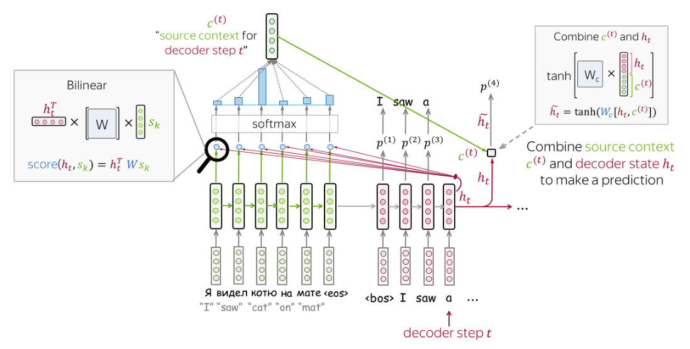

# Implementación del Modelo de Traducción con Mecanismos de Atención en PyTorch

<br>

## Introducción

Este proyecto presenta la implementación de un modelo de traducción basado en la arquitectura **Seq2Seq** con diferentes tipos de atención en PyTorch. Los mecanismos de atención implementados incluyen:
1. **Producto escalar simple.**
2. **Atención de Luong (bilineal).**
3. **Atención de Bahdanau (perceptrón multicapa).**

El modelo se aplica a la tarea de traducción inglés-español con un enfoque en datasets pequeños y controlados. También se incluye una evaluación detallada de los resultados de atención para garantizar su correcta implementación.

<br>

## Arquitectura

El modelo combina los siguientes componentes principales:

### 1. **Atención**
   - **Producto Escalar**: Calcula la similitud entre la salida del decodificador y las salidas del codificador mediante un producto escalar normalizado con softmax.


   - **Atención de Luong**: Introduce una matriz de pesos entrenable que modifica las relaciones entre los estados del codificador y el decodificador.



   - **Atención de Bahdanau**: Utiliza un perceptrón multicapa que concatena los estados del codificador y el decodificador para calcular puntuaciones de atención más complejas.


### 2. **Codificador y Decodificador**
   - Basados en **LSTM**, procesan las secuencias de entrada y salida respectivamente.
   - El codificador genera representaciones contextuales de la secuencia de entrada.
   - El decodificador produce palabras en el idioma objetivo utilizando la atención como un puente entre los estados ocultos del codificador y las salidas generadas.

### 3. **Modelo Seq2Seq**
   - Combina el codificador, el decodificador y el mecanismo de atención.
   - Genera las predicciones palabra por palabra, utilizando "teacher forcing" durante el entrenamiento.

<br>

## Cómo Usar

### Configuración Inicial
1. **Clonar el repositorio**:
   ```bash
   git clone <URL>
   ```
2. **Preparar los datos**:
   Asegúrate de tener archivos de entrada en inglés y español en la carpeta `data/mock`.

3. **Importar el modelo y sus componentes**:
   ```python
   from seq2seq.model import Seq2Seq
   from seq2seq.attention import DotAttention, LuAttention, BaAttention
   from seq2seq.dataloader import Translation
   ```

<br>

## Prueba de la Atención

En el notebook `tests.ipynb` se realizan pruebas para cada tipo de mecanismo implementado. Para ello, a cada mecanismo se le proporcionan secuencias de entrada y salida aleatorias, atendiendo cuidadosamente a sus dimensiones, y se comprobó que el resultado de la atención es correcto en cuanto a dimensiones.

Se probó, con cada mecanismo, a calcular la atención sobre los siguientes tensores:

```
A = torch.tensor([[[1, 2, 3], [2, 2, 3]], [[4, 5, 6], [4, 5, 6]]])
b = torch.tensor([[7, 8, 9], [2, 1, 1]])
```

Y el resultado obtenido fue el siguiente:

- **Producto Escalar**: El mecanismo de atención por producto escalar se encarga de calcular la similitud entre las salidas del codificador y las salidas del decodificador mediante un producto escalar normalizado con softmax. En este caso, el resultado obtenido fue:

```
Attention result tensor([[1.9991, 2.0000, 3.0000],
        [4.0000, 5.0000, 6.0000]])
```

- **Atención de Luong**: La atención de Luong introduce una matriz de pesos entrenable que modifica las relaciones entre los estados del codificador y el decodificador. En este caso, el resultado obtenido fue:

```
Attention result tensor([[1.2512, 2.0000, 3.0000],
        [4.0000, 5.0000, 6.0000]], grad_fn=<SqueezeBackward0>) torch.Size([2, 3])
```

- **Atención de Bahdanau**: La atención de Bahdanau utiliza un perceptrón multicapa que concatena los estados del codificador y el decodificador para calcular puntuaciones de atención más complejas. En este caso, el resultado obtenido fue:

```
Attention result tensor([[1.4998, 2.0000, 3.0000],
        [4.0000, 5.0000, 6.0000]], grad_fn=<SqueezeBackward0>) torch.Size([2, 3])
```

Podemos apreciar que los resultados obtenidos son correctos en cuanto a dimensiones y valores, lo que indica que la implementación de los mecanismos de atención es correcta. No obstante, podemos apreciar que los valores obtenidos son diferentes, lo que indica que cada mecanismo de atención realiza un cálculo distinto, lo cual permitirá presentar resultados diferentes en la traducción de las secuencias.

<br>

## Traducción Inglés-Español

### Dataset
Se utiliza un dataset básico con frases sencillas y sus traducciones, como:
- Inglés: "the apple"
- Español: "la manzana"

El dataset incluye marcadores especiales (`<sos>`, `<eos>`, `<pad>`) para indicar el inicio, final y relleno en las secuencias.

### Configuración del Modelo
- **Dimensión de entrada**: 300 (embeddings preentrenados de FastText).
- **Dimensión del estado oculto**: 512.
- **Capas del LSTM**: 2.
- **Aprendizaje**: Optimizador Adam con tasa de aprendizaje de 0.001.

### Entrenamiento
El modelo se entrena durante 60 épocas, utilizando "teacher forcing" para mejorar la convergencia. La pérdida se calcula con entropía cruzada sobre cada palabra de la salida esperada.

<br>

## Resultados

### Ejemplo de Traducción
Entrada: `"the apple"`
Salida esperada: `"la manzana"`
Predicción: `"la manzana"`

### Mapas de Atención
Se generaron mapas de calor que visualizan cómo el modelo asigna importancia a las palabras de entrada al generar cada palabra de salida. 

Ejemplo de mapa de atención para `"the apple"`:

<p align="center">

</p>

<br>

## Conclusión

El modelo implementado demuestra ser efectivo para aprender y aplicar mecanismos de atención en tareas de traducción. Los experimentos confirman que:
1. La atención mejora significativamente la capacidad del modelo para manejar relaciones contextuales complejas.
2. La atención de Bahdanau ofrece un rendimiento superior en casos donde el contexto global es crítico.

Este proyecto proporciona una base sólida para explorar y extender el uso de atención en modelos más avanzados y tareas más complejas.